<p align="center">
  
</p>

# Universidad de San Carlos de Guatemala  
## Facultad de Ingeniería  
### Escuela de Ciencias y Sistemas  
### Laboratorio de Organización Computacional  

---

# 🧠 Proyecto Final: Buscaminas

**Integrantes:**  
- Pedro Daniel Sis Barrios – *202002225*  
- Edy Rolando Rojas González – *201730511*  
- Carlos Alejandro Rosales Medina – *201901657*  
- Oscar Vladimir Nij Cruz – *202100076*  
- David Andrés Jiménez Paniagua – *202004777*  
- Nelson Emanuel Cún Bálan – *201222010*  

<p align="center">
  📅 <strong>Fecha de entrega:</strong> 3 de mayo de 2025
</p>

---

## 📘 Índice

1. [Introducción](#introducción)  
2. [Objetivos del Proyecto](#objetivos-del-proyecto)  
3. [Descripción del Problema](#descripción-del-problema)  
4. [Configuración del Módulo Bluetooth](#configuración-del-módulo-bluetooth)  
5. [Diagramas del Diseño del Circuito](#diagramas-del-diseño-del-circuito)  
6. [Funciones Booleanas y Mapas de Karnaugh](#funciones-booleanas-y-mapas-de-karnaugh)  
7. [Código Arduino](#código-arduino)  
8. [Equipo Utilizado](#equipo-utilizado)  
9. [Presupuesto](#presupuesto)  
10. [Conclusiones](#conclusiones)  
11. [Anexos](#anexos)

---

## 📌 Introducción

Este informe describe la creación de un prototipo físico del juego **Buscaminas**, implementado con lógica digital combinacional y secuencial. Se utilizaron flip-flops para simular una memoria RAM, y un módulo Bluetooth para interactuar con una aplicación web. El objetivo fue comprender el funcionamiento interno de un sistema digital a través del desarrollo de un proyecto funcional.

---

## 🎯 Objetivos del Proyecto


### 🎯 Objetivo General

Diseñar e implementar una versión física del juego *Buscaminas* usando lógica digital, una memoria RAM hecha con flip-flops, y comunicación Bluetooth con una interfaz web.

### ✅ Objetivos Específicos

- Crear una RAM 4x4 con flip-flops.  
- Diseñar un sistema de estados secuencial para controlar el juego.  
- Establecer comunicación serial con un módulo Bluetooth.  
- Implementar una interfaz web funcional.  
- Mostrar puntuación y estado en una pantalla LCD.  
- Aplicar mapas de Karnaugh para simplificar funciones.  
- Documentar todo el proceso de diseño y desarrollo.

---

## 🧩 Descripción del Problema

El reto consiste en implementar el juego **Buscaminas** usando lógica digital sin microcontroladores que controlen toda la lógica. El tablero del juego se configura antes de comenzar mediante comandos enviados por Bluetooth. Un sistema de estados permite controlar la partida y verificar condiciones de victoria o derrota. La RAM construida con flip-flops actúa como base de datos para la lógica del juego.

---

## 📶 Configuración del Módulo Bluetooth

Pasos para configurar el módulo **HC-06**:

1. Conectar los pines:  
   - **VCC** → 5V  
   - **GND** → GND  
   - **TX** → RX del Arduino  
   - **RX** → TX del Arduino (usar divisor de voltaje si es necesario)

2. Emparejar el módulo con un dispositivo móvil.  
3. Usar una app como **Serial Bluetooth Terminal** o una web conectada al puerto COM para enviar comandos.  
4. Velocidad de comunicación: **9600 baudios**.  

---

## 🧮 Diagramas del Diseño del Circuito

### 🔌 Circuito de RAM

<p align="center">
  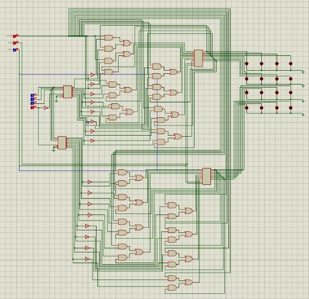
</p>
> Este diagrama muestra la configuración de la RAM 4x4 implementada con flip-flops. Cada celda representa un bit de memoria.


## 🧮 Diagramas del Diseño del Circuito


### 🔌 Programacion del backend 

<p align="center">
  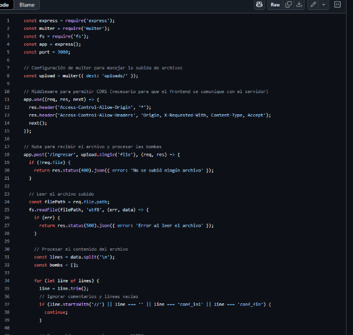
</p>
> Este diagrama ilustra el sistema de estados secuencial que controla la lógica del juego.

### 🔌 Programacion del frontend 
<p align="center">
  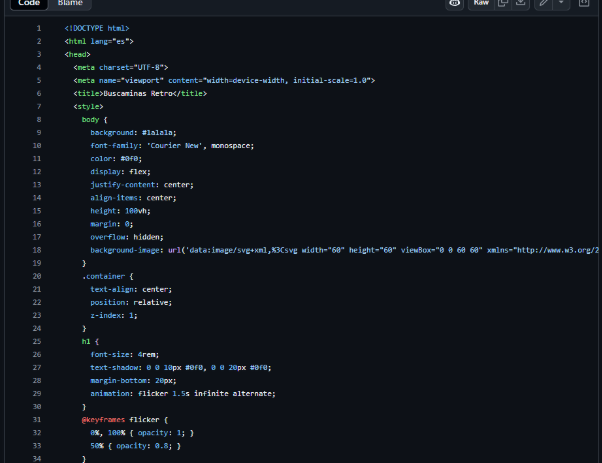
</p>
> Este diagrama ilustra el sistema de estados secuencial que controla la lógica del juego.


### 🔌 Funciones Booleanas y Mapas de Karnaugh

####  comportamiento de los flipflops de la RAM.

<p align="center">
  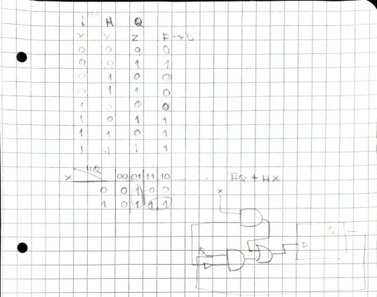
</p>
> Este diagrama ilustra el sistema de estados secuencial que controla el comportamiento de los flipflops de la RAM.
### 🔌 Estados del juego

<p align="center">
  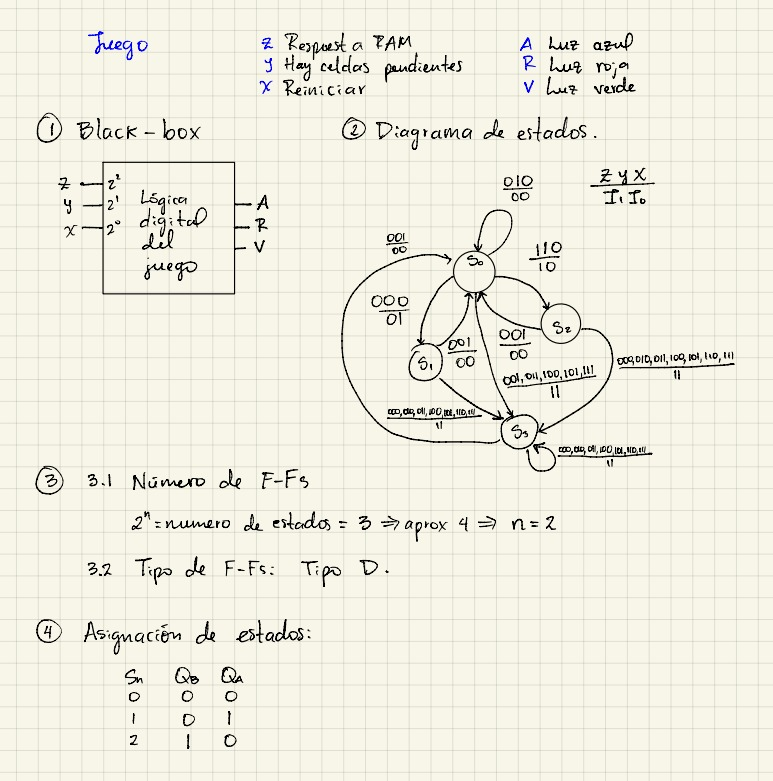
  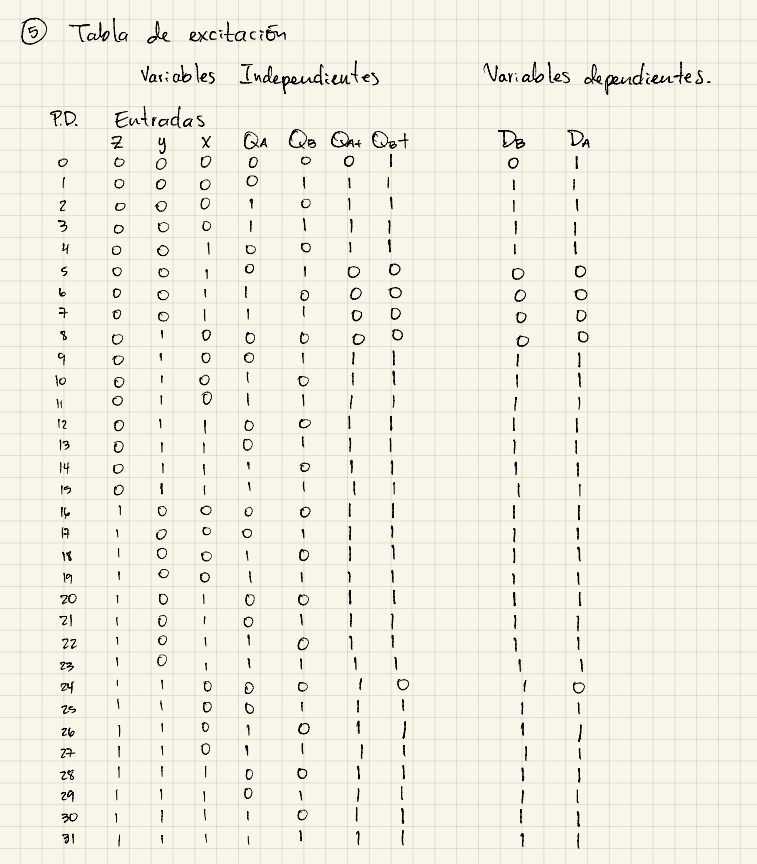
  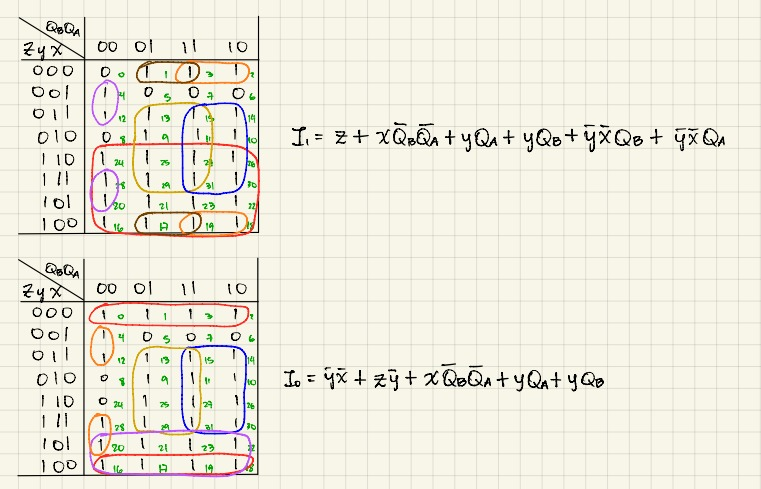
  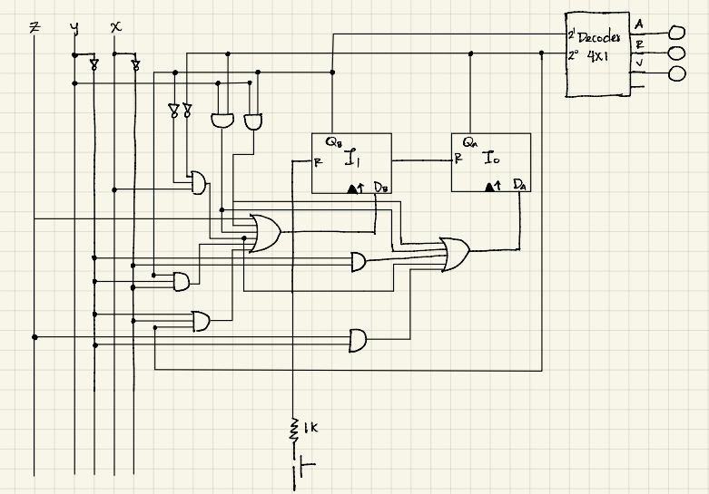
</p>

> Estos diagramas ilustran el sistema de estados secuencial que controla la lógica del juego.


### 🔐 Código: Control de Contraseña con Teclado y Motor
Este código está diseñado para controlar un motor y un zumbador (buzzer) utilizando un teclado matricial 4x4 conectado a un microcontrolador (como un Arduino). Además, implementa un sistema de verificación de contraseña.

```cpp
#include <Keypad.h>

// Definición del teclado matricial
const byte ROWS = 4;
const byte COLS = 4;
char keys[ROWS][COLS] = {
  {'1', '2', '3', 'A'},
  {'4', '5', '6', 'B'},
  {'7', '8', '9', 'C'},
  {'*', '0', '#', 'D'}
};
byte rowPins[ROWS] = {9, 8, 7, 6}; // Pines de las filas
byte colPins[COLS] = {5, 4, 3, 2}; // Pines de las columnas
Keypad keypad = Keypad(makeKeymap(keys), rowPins, colPins, ROWS, COLS);

// Definición del puente H
const int motorPin1 = 11; // Pin de control 1 del puente H
const int motorPin2 = 13; // Pin de control 2 del puente H
const int buzzerPin = 12;

// Definición de la contraseña
const String password = "123";
String enteredPassword = "";
bool motorDirection = false; // false = dirección 1, true = dirección 2

void setup() {
  pinMode(motorPin1, OUTPUT);
  pinMode(motorPin2, OUTPUT);
  pinMode(buzzerPin, OUTPUT); // Configurar el pin del zumbador como salida
  Serial.begin(9600);
}

void loop() {
  char key = keypad.getKey();

  if (key) {
    if (key == '#') { // # para borrar
      enteredPassword = "";
      Serial.println("Contraseña borrada.");
    } else if (key == '*') { // * para confirmar
      if (enteredPassword == password) {
        Serial.println("Contraseña correcta.");
        controlMotor();
      } else {
        Serial.println("Contraseña incorrecta.");
        activateBuzzer(); // Activar el zumbador
      }
      enteredPassword = "";
    } else {
      enteredPassword += key;
      Serial.print(key);
    }
  }
}

void controlMotor() {
  if (motorDirection) {
    digitalWrite(motorPin1, HIGH);
    digitalWrite(motorPin2, LOW);
    Serial.println("Motor en dirección 1.");
  } else {
    digitalWrite(motorPin1, LOW);
    digitalWrite(motorPin2, HIGH);
    Serial.println("Motor en dirección 2.");
  }
  motorDirection = !motorDirection;
  delay(5000);
  digitalWrite(motorPin1, LOW);
  digitalWrite(motorPin2, LOW);
  Serial.println("Motor detenido.");
}

void activateBuzzer() {
  digitalWrite(buzzerPin, HIGH);
  delay(1000);
  digitalWrite(buzzerPin, LOW);
}
```

---

### 📶 Configuración del Módulo Bluetooth HC-05

Este código configura el módulo Bluetooth HC-05 en modo AT para establecer el nombre del dispositivo, la velocidad de comunicación y el PIN de emparejamiento. Además, utiliza un LED para indicar cuándo se ha completado la configuración.

```cpp
// DECLARACIONES
const int LED = 13;
const int BTPWR = 12;

char nombreBT[8] = "PRUEBABT"; 
char velocidad = '9600';
char pin[5] = "0000";

void setup() {
  pinMode(LED, OUTPUT);
  pinMode(BTPWR, OUTPUT);

  digitalWrite(LED, LOW);
  digitalWrite(BTPWR, HIGH);

  Serial.begin(9600);

  Serial.print("AT");
  delay(1000);

  Serial.print("AT+NAME");
  Serial.print(nombreBT);
  delay(1000);

  Serial.print("AT+BAUD");
  Serial.print(velocidad);
  delay(1000);

  Serial.print("AT+PIN");
  Serial.print(pin);
  delay(1000);

  digitalWrite(LED, HIGH);
}

void loop() {
}
```

---


## 🧩 Equipo Utilizado

### Listado de Componentes

- **Arduino UNO**
- **Módulo Bluetooth HC-06**
- **Flip-flops 74174 / 74374**
- **Puertas lógicas:** 7408, 7432, 7404, 7486
- **Multiplexor 74153**
- **Demultiplexor 74138**
- **Pantalla LCD 16x2**
- **Protoboard y cables**
- **Fuente de alimentación**

### Herramientas de Software

- **Proteus** para simulación
- **Arduino IDE** para programación

---

## 💸  Presupuesto

Dicho presupuesto fue contemplado en cada fase del trabajo siendo un resultado total de ciento cincuenta quetzales exactos (Q150.00)dicha cantidad está incluida en la prevención de problemas que pudieron ser suscitados durante la creación de la práctica siendo así tener equipo de emergencia en cualquier problema que se pudo presenciar 

<p align="center">
  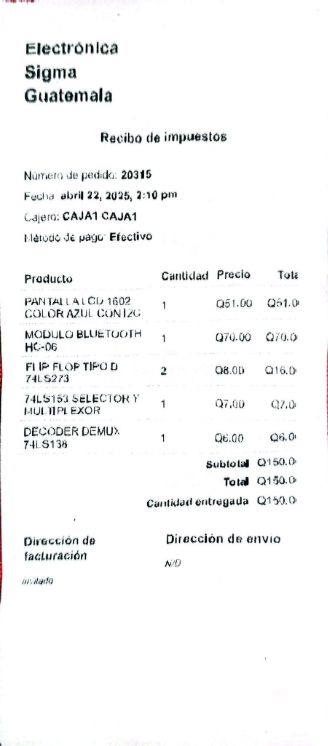
</p>

> Este diagrama muestra la factura de los componentes usados.
---

---
## 💬Conclusiones

### Resultados obtenidos:

Se llevó a cabo la implementación exitosa de una versión que funcionara correctamente del juego “Buscaminas” únicamente utilizando componentes de lógica digital, sin recurrir a memorias que fueran comerciales ni microcontroladores para el almacenamiento del mismo. Se hizo una RAM 4x4 mediante el uso de flip-flops, así como un sistema de control implementado sobre lógica secuencial que gestiona el juego de forma clara. También se realizó una comunicación eficaz del sistema físico con un aparato de telefonía móvil mediante Bluetooth que posibilitaba al usuario interactuar con el juego mediante sendas instrucciones que enviaba con una aplicación web o bien desde una terminal serial. El sistema reaccionó correctamente a todas las funciones esperadas, éstas son: la configuración del tablero, la interacción del usuario, el hecho de ser certero, o la visualización del estado del juego con LEDs y una pantalla LCD.

---

### Aprendizajes:

En el transcurso de la ejecución del mismo se trató el diseño y el análisis de sistemas digitales a la altura de compuertas lógicas y flip-flops, entendiendo cómo construir estructuras que sirvan para almacenar datos y controlar los mismos sin la utilización de microprocesadores complejos. Así pues, se profundizaron conocimientos sobre el simplificado de funciones booleanas, así como el manejo de mapas de Karnaugh; se aprendieron a diseñar circuitos combinacionales y secuenciales. Todo ello se aplicó a la implementación de un sistema de estados para codificar la lógica de control del comportamiento del juego. En el ámbito de la comunicación, se abarcaron conocimientos en el uso de módulos Bluetooth, el manejo de datos seriales y el diseño de interfaces web sencillas que interactuaran con el hardware externo. El proyecto también motivó el trabajo en grupo, la documentación técnica escrita de forma adecuada y la integración entre hardware y software.

---

### Recomendaciones:

- Utilizar simuladores digitales previos al armado físico del circuito para detectar errores lógicos antes de implementarlos con componentes reales.
- Documentar el diseño paso a paso, incluyendo funciones booleanas, estados, y conexiones de pines, para facilitar la depuración.
- Considerar el uso de un microcontrolador más avanzado o una FPGA para futuras versiones, con el fin de simplificar el diseño y añadir funcionalidades como temporizadores, niveles de dificultad o sonidos.
- Proteger los componentes físicos con un chasis o base estable, ya que los múltiples cables en protoboard pueden desconectarse fácilmente.
- Explorar opciones para hacer el juego más dinámico, como una interfaz gráfica móvil más robusta o indicadores visuales más complejos (pantallas gráficas, matrices de LEDs).


---

---

## 📎 Anexos

### 📷 Imágenes del Proyecto

#### inicio del programa 
<p align="center">
  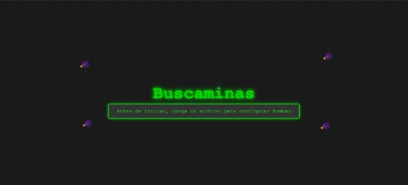
</p>

#### inicio del juego
<p align="center">
  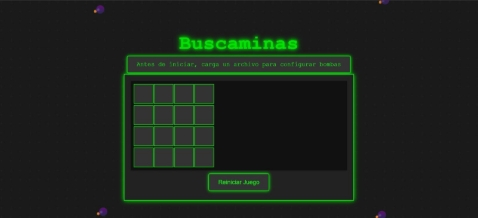
</p>

#### Interfaz Web
<p align="center">
  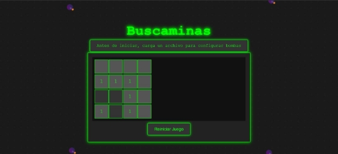
</p>

#### game over
<p align="center">
  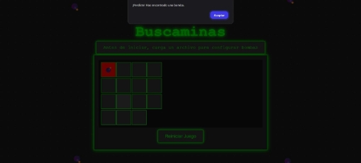
</p>

#### victoria del jugador 
<p align="center">
  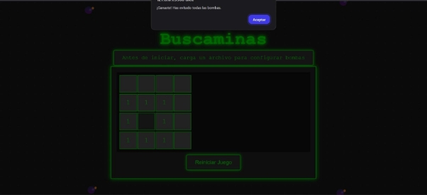
</p>


---

### 📜 Código Fuente

El código fuente completo del proyecto, incluyendo la programación del Arduino y la interfaz web, se encuentra disponible en el repositorio del equipo. Para acceder, visita el siguiente enlace:

[Repositorio del Proyecto Buscaminas](https://github.com/DavidPaniagua5/-ORGA-Proyecto1)

---

